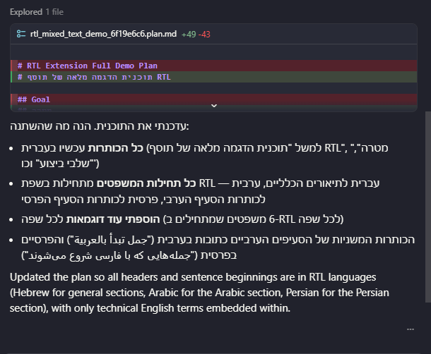
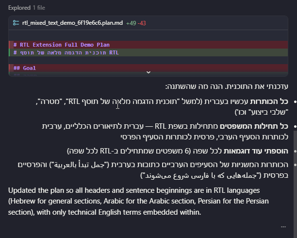
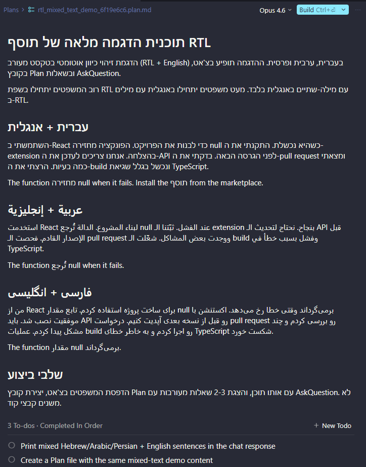
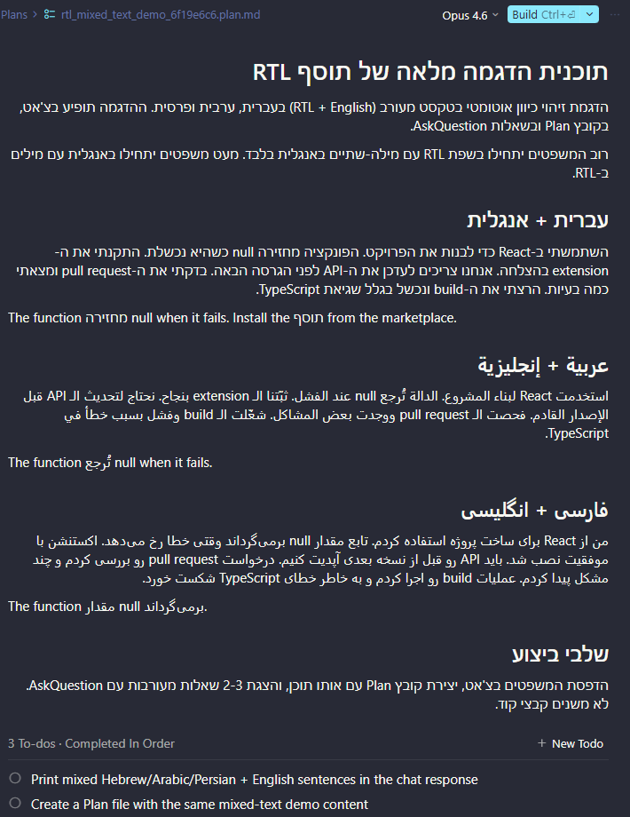
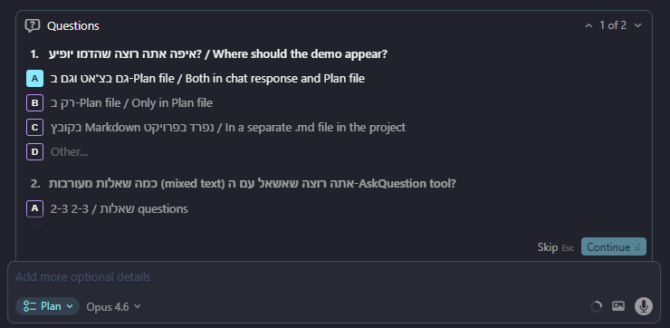

# Cursor RTL - Extension

Smart multi-language RTL support for [Cursor](https://cursor.com) AI Chat. Uses a purpose-built algorithm that auto-detects text direction per element - Hebrew, Arabic and Persian text is automatically right-aligned, while English text stays left-aligned. Mixed-language conversations just work.

**[Documentation](https://motcke.github.io/cursor-ext-rtl/)**

---

## Screenshots

### Chat

| Before | After |
|--------|-------|
|  |  |

### Plan

| Before | After |
|--------|-------|
|  |  |

### Questions

| Before | After |
|--------|-------|
|  |  |

---

## Features

- **Smart multi-language algorithm** - auto-detects text direction per element; only RTL text (Hebrew, Arabic, Persian) is right-aligned, English stays left-aligned
- **One-click Enable/Disable** via Command Palette
- **Status Bar indicator** showing current RTL patch state (ON / OFF / UPDATE NEEDED)
- **Automatic update detection** when Cursor updates overwrite `main.js`
- **Auto re-apply option** to silently re-apply after Cursor updates
- **Transactional patching** with automatic backup and rollback on failure
- **Cross-platform** support for Windows, macOS, and Linux

## Commands

| Command | Description |
|---------|-------------|
| `Cursor RTL: Enable RTL Support` | Backup `main.js`, apply RTL patch, copy `rtl.js` |
| `Cursor RTL: Disable RTL Support` | Restore `main.js` from backup, remove `rtl.js` |
| `Cursor RTL: Check Status` | Show whether the RTL patch is currently active |
| `Cursor RTL: Re-apply After Update` | Re-apply patch after a Cursor update overwrote it |

## Status Bar

- **RTL: ON** - Patch is active
- **RTL: OFF** - Patch is not applied
- **RTL: UPDATE NEEDED** - Cursor was updated, patch needs re-applying

Click the status bar item for a quick-pick menu with available actions.

## Settings

| Setting | Default | Description |
|---------|---------|-------------|
| `cursorRtl.autoReapply` | `false` | Automatically re-apply RTL patch when Cursor updates overwrite `main.js` |
| `cursorRtl.showStatusBar` | `true` | Show RTL status indicator in the status bar |

## Installation

1. Download the latest `.vsix` from the [Releases page](https://github.com/motcke/cursor-ext-rtl/releases)
2. In Cursor, open the Extensions view (`Ctrl+Shift+X`) → click the `...` menu (top-right) → select **Install from VSIX...** → choose the downloaded file
3. Look for **"RTL: OFF"** on the right side of the bottom status bar → click it → select **Enable RTL**
4. Approve the installation → close and reopen **all** Cursor windows

> **Note:** If Cursor is installed in a system directory (e.g. `C:\Program Files`), you may need to run Cursor as Administrator for the patch to apply.

## How It Works

### What gets modified

This extension modifies two files inside Cursor's app directory:

1. **`main.js`** - A single line is inserted after the copyright comment to load the RTL script
2. **`rtl.js`** - The RTL styling/detection script is copied alongside `main.js`

### Safety measures

- **Timestamped backups**: Before any modification, `main.js` is backed up as `main.js.rtl-backup-<timestamp>`
- **Signature verification**: The extension verifies that `main.js` contains the expected Microsoft copyright comment before patching
- **Idempotent operations**: Enabling when already enabled does nothing; disabling when not enabled does nothing
- **Transactional writes**: If patching fails mid-way, the backup is automatically restored
- **Dry-run preview**: Before enabling, you see exactly which files will be modified

### Rollback

To completely undo all changes:

1. Run `Cursor RTL: Disable RTL Support` from the Command Palette
2. Restart Cursor

This restores the original `main.js` from the backup and removes the `rtl.js` file.

## Known Limitations

- Cursor updates may overwrite `main.js`, requiring re-application of the patch
- The extension shows a "[Unsupported]" warning in Cursor's title bar (same as any extension that modifies app files, like Custom CSS extensions)
- Requires write permissions to Cursor's app directory (may need Administrator/sudo on some systems)

## Supported Cursor Versions

Compatible with Cursor 2.4.37+ (uses `app.on('browser-window-created')` pattern).

## Troubleshooting

| Issue | Solution |
|-------|----------|
| Permission denied | **Windows**: Run Cursor as Administrator. **macOS/Linux**: Fix file permissions with `sudo chown` |
| RTL not working after Enable | Make sure to restart Cursor after enabling |
| Patch removed after update | Use "Re-apply After Update" or enable `cursorRtl.autoReapply` setting |
| Cursor won't start | Run "Disable RTL Support" or manually restore `main.js` from the backup file |

## License

Apache 2.0 - see [LICENSE](LICENSE) for details.
