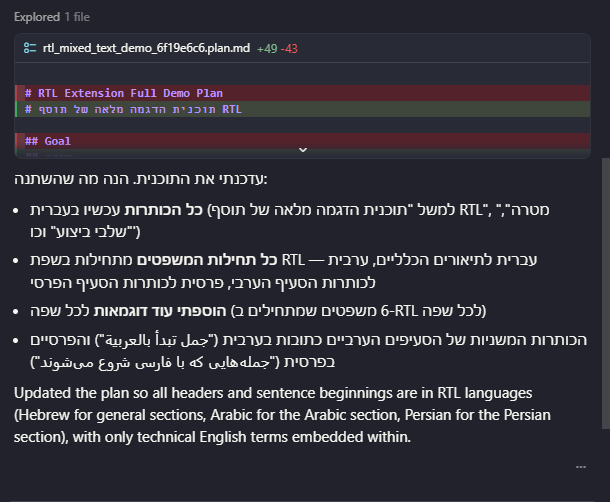
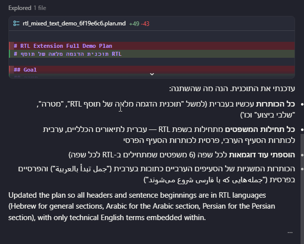
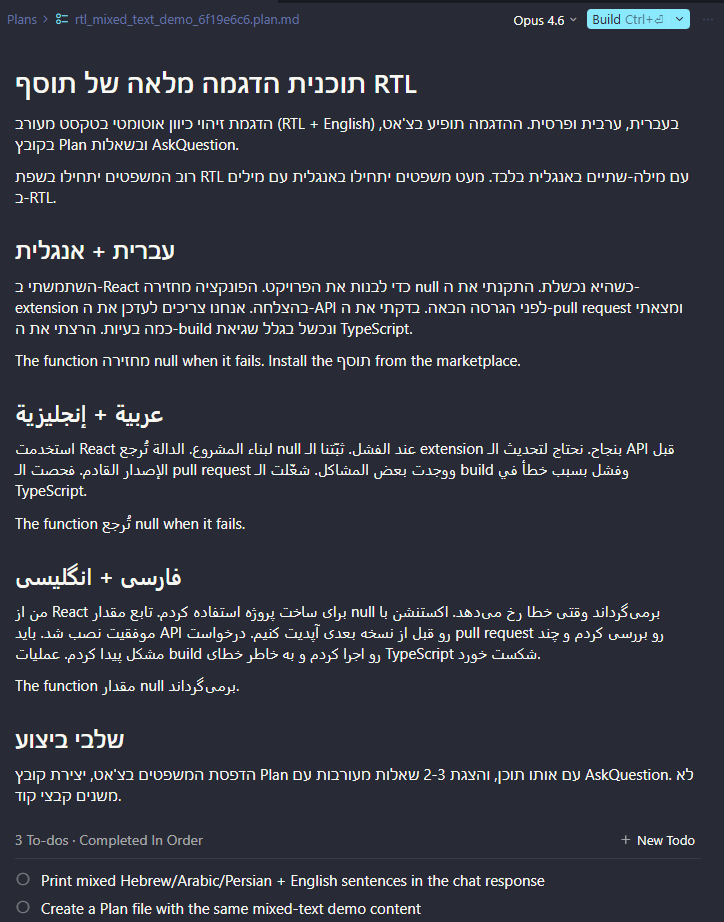
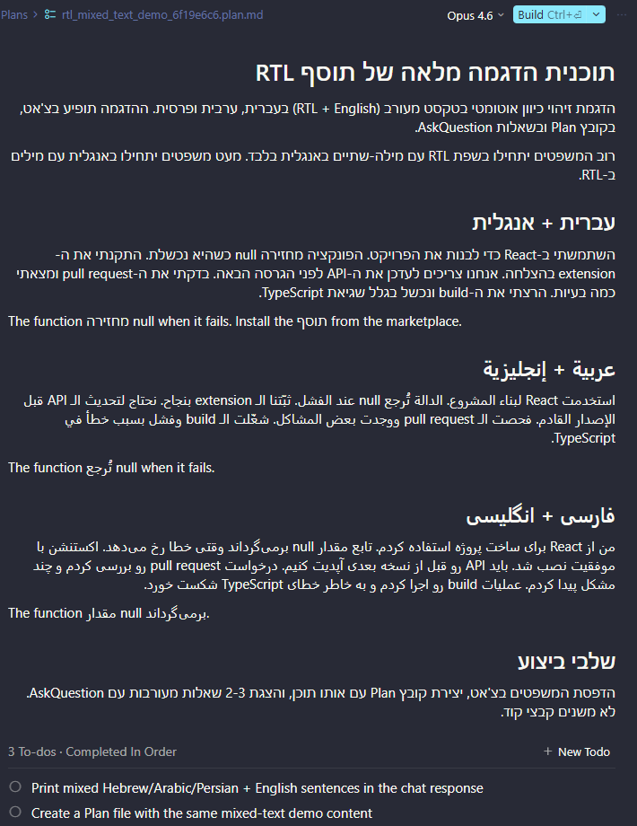
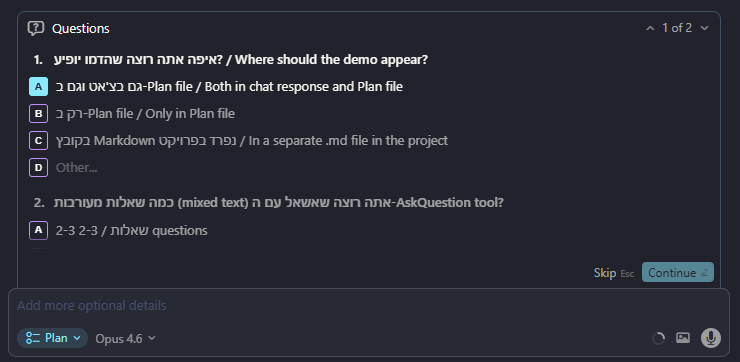
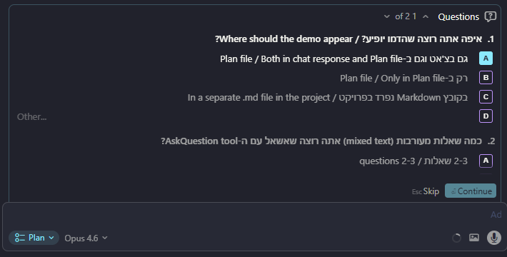

# Cursor RTL - Extension

Smart multi-language RTL support for [Cursor](https://cursor.com) AI Chat, Agents Window and Plan files. Uses a purpose-built algorithm that detects text direction per element - Hebrew, Arabic and Persian text is automatically right-aligned, while English text stays left-aligned. Mixed-language conversations just work.

**[Documentation](https://motcke.github.io/cursor-ext-rtl/)**

---

## Screenshots

### Chat

| Before | After |
|--------|-------|
|  |  |

### Plan

| Before | After |
|--------|-------|
|  |  |

### Questions

| Before | After |
|--------|-------|
|  |  |

---

## Features

- **Smart multi-language algorithm** - detects text direction per element using weighted RTL/LTR scoring, so Hebrew, Arabic and Persian content is right-aligned while English-heavy content stays left-aligned
- **Code editor (Monaco) RTL** - the same per-file detection extends to the main editing pane (including Markdown and plain-text files): RTL-dominant files flow right-to-left (with the vertical scrollbar moved to the left and left/right arrow keys swapped to match), while English and code files stay untouched. Choose `auto` / `always` / `off` via setting or quick-pick
- **One-click Enable/Disable** via Command Palette
- **Status Bar indicator** showing current RTL patch state (ON / OFF / UPDATE NEEDED)
- **Automatic update detection** when Cursor updates overwrite `main.js`
- **Extension update checks** with release-page and VSIX download shortcuts
- **Auto re-apply option** to silently re-apply after Cursor updates
- **Markdown table support** for mixed RTL/LTR table content, including Plan files
- **Plan editor support** for Cursor's TipTap/ProseMirror-based `.plan.md` editor
- **Agents Window support** including the agent conversation and side Plan view
- **Transactional patching** with automatic backup and rollback on failure
- **Cross-platform** support for Windows, macOS, and Linux

## Commands

| Command | Description |
|---------|-------------|
| `Cursor RTL: Enable RTL Support` | Backup `main.js`, apply RTL patch, copy the loader script |
| `Cursor RTL: Disable RTL Support` | Restore `main.js` from backup, remove the loader script |
| `Cursor RTL: Check Status` | Show whether the RTL patch is currently active |
| `Cursor RTL: Re-apply After Update` | Re-apply patch after a Cursor update overwrote it |
| `Cursor RTL: Check for Extension Updates` | Check GitHub releases for a newer extension version |
| `Cursor RTL: Code Editor Direction (Auto / Always / Off)` | Choose how the code editor (Monaco) — including Markdown/plain-text — picks its direction |

## Status Bar

- **RTL: ON** - Patch is active
- **RTL: OFF** - Patch is not applied
- **RTL: UPDATE NEEDED** - Cursor was updated, patch needs re-applying

Click the status bar item for a quick-pick menu with available actions.

## Settings

| Setting | Default | Description |
|---------|---------|-------------|
| `cursorRtl.editorRtl` | `auto` | Code editor (Monaco) direction — the main editing pane, including Markdown and plain-text files. `auto` follows each file's dominant language, `always` forces RTL, `off` leaves the editor untouched. Applies live to open windows |
| `cursorRtl.autoReapply` | `false` | Automatically re-apply RTL patch when Cursor updates overwrite `main.js` |
| `cursorRtl.showStatusBar` | `true` | Show RTL status indicator in the status bar |
| `cursorRtl.checkForExtensionUpdates` | `true` | Automatically check GitHub releases for Cursor RTL extension updates |
| `cursorRtl.updateCheckIntervalHours` | `6` | How often to check for extension updates while Cursor is open |
| `cursorRtl.updateRemindLaterHours` | `24` | How long to wait before showing the same update again after choosing Remind Later |

## Installation

1. Download the latest `.vsix` from the [Releases page](https://github.com/motcke/cursor-ext-rtl/releases)
2. In Cursor, press `Ctrl+Shift+P` to open the Command Palette → search for `VSIX` → select **Extensions: Install from VSIX...** → choose the downloaded file
3. Look for **"RTL: OFF"** on the right side of the bottom status bar → click it → select **Enable RTL**
4. Approve the installation → close and reopen **all** Cursor windows

> **Note:** If Cursor is installed in a system directory (e.g. `C:\Program Files`), you may need to run Cursor as Administrator for the patch to apply.

## How It Works

### What gets modified

This extension modifies two files inside Cursor's app directory:

1. **`main.js`** - A single line is inserted after the copyright comment to load the RTL script
2. **`cursor-rtl-loader.cjs`** - A small loader is copied alongside `main.js`; it injects the extension's bundled `resources/rtl.js` into Cursor workbench windows

The `rtl.js` styling and direction script stays in the installed extension directory, so it updates with the extension package.

### Runtime behavior

The loader runs in Cursor's Electron main process. It watches existing and newly-created browser windows, waits until a window has loaded `workbench.html`, and then injects `rtl.js` once for that workbench URL.

Inside the workbench, `rtl.js` does an initial scan at startup, a few delayed startup scans while Cursor finishes rendering, and then re-scans on relevant DOM mutations, focus changes, and visibility changes. It is not a continuous polling loop.

The direction algorithm assigns an explicit `dir="rtl"` or `dir="ltr"` to matching Markdown, chat and composer elements. For mixed text, RTL characters are scored against weighted LTR tokens; code-like tokens such as paths, API names and uppercase identifiers count less than regular English words. Lists and tables use the majority direction of their direct items or cells.

Plan files and the Agents Window side Plan view use Cursor's TipTap/ProseMirror rich-text editor. Because that editor owns and may rewrite its DOM, Plan content also gets generated CSS rules scoped to the active Plan editor instead of relying only on direct `dir` attributes.

For the code editor (Monaco) — the main editing pane, including Markdown and plain-text files — the same scorer samples each editor's visible lines and, when RTL-dominant (or when `cursorRtl.editorRtl` is `always`), marks it with a `data-cursor-rtl-dir="rtl"` attribute. Scoped CSS then flips the view lines to RTL, moves the vertical scrollbar to the left, and reorders Monaco's per-token spans so leading list markers and punctuation land on the right. Because Monaco's cursor controller has no RTL mode, a small keydown handler swaps the left/right arrows (keeping Shift/Alt/Ctrl/Meta) only while a marked-RTL editor is focused. The chosen mode is written to `~/.cursor-rtl-config.json`, which the loader watches so changes apply live without a reload.

### Safety measures

- **Timestamped backups**: Before any modification, `main.js` is backed up as `main.js.rtl-backup-<timestamp>`
- **Signature verification**: The extension verifies that `main.js` contains the expected Microsoft copyright comment before patching
- **Idempotent operations**: Enabling when already enabled does nothing; disabling when not enabled does nothing
- **Transactional writes**: If patching fails mid-way, the backup is automatically restored
- **Dry-run preview**: Before enabling, you see exactly which files will be modified

### Rollback

To completely undo all changes:

1. Run `Cursor RTL: Disable RTL Support` from the Command Palette
2. Restart Cursor

This restores the original `main.js` from the backup and removes the copied loader script.

## Known Limitations

- Cursor updates may overwrite `main.js`, requiring re-application of the patch
- The extension shows a "[Unsupported]" warning in Cursor's title bar (same as any extension that modifies app files, like Custom CSS extensions)
- Requires write permissions to Cursor's app directory (may need Administrator/sudo on some systems)
- Code editor RTL is a styling + input layer on top of Monaco, which has no native RTL mode. Visual order and arrow-key movement are corrected, but deeply mixed bidi lines can still have edge cases, and the line-number gutter stays on the left (moving it detaches Monaco's line-number positioning)

## Supported Cursor Versions

Compatible with Cursor 2.4.37+ (uses `app.on('browser-window-created')` pattern).

## Development

Visual checks can capture and compare the real Cursor UI for RTL layout regressions:

```powershell
npm run visual:capture
npm run visual:compare
```

See [`visual/README.md`](visual/README.md) for the full workflow and privacy notes.

## Privacy and Telemetry

Cursor RTL collects telemetry for the sole purpose of improving the extension, understanding failures, and maintaining compatibility with Cursor updates. Telemetry is enabled by default.

The extension may send usage events such as extension startup/shutdown, patch apply/remove/reapply, status checks, update detection, and version availability. These events may include diagnostic environment details such as Cursor version, release channel, patch state, platform, architecture, locale, timezone, hostname, OS username, and home directory. The extension does not intentionally send workspace file contents, editor text, or clipboard contents.

### Opt out

Telemetry can be disabled with an advanced environment variable before launching Cursor:

```powershell
$env:CURSOR_RTL_TELEMETRY_OPTOUT = "1"
& "$env:LOCALAPPDATA\Programs\cursor\Cursor.exe"
```

Persistent opt-out can be configured at the operating system level by setting `CURSOR_RTL_TELEMETRY_OPTOUT=1` for the user or machine environment. `CURSOR_RTL_DISABLE_TELEMETRY=1` is also supported.

The loader writes a local debug log to `cursor-rtl.log` in the user's home directory. It is not sent by telemetry, but it may include local extension paths and workbench URLs, so review it before sharing.

## Troubleshooting

| Issue | Solution |
|-------|----------|
| Permission denied | **Windows**: Run Cursor as Administrator. **macOS/Linux**: Fix file permissions with `sudo chown` |
| RTL not working after Enable | Make sure to restart Cursor after enabling |
| Patch removed after update | Use "Re-apply After Update" or enable `cursorRtl.autoReapply` setting |
| Cursor won't start | Run "Disable RTL Support" or manually restore `main.js` from the backup file |

## License

Apache 2.0 - see [LICENSE](LICENSE) for details.
